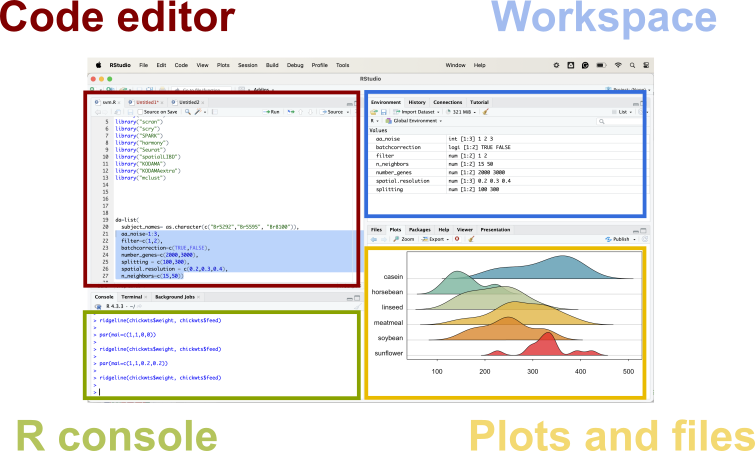

# Basics in R

> ***Open RStudio and take a few minutes to explore each pane and its functionality.***

### 1. Familiarize with the RStudio Interface

In this section, we'll get to know the RStudio interface and understand its different components:

-   **Layout**: The RStudio interface consists of several panes that help you manage your workflow efficiently.

-   **Panes**: These include the Source Pane, Console, Environment/History Pane, and the Files/Plots/Packages/Help/Viewer Pane.

-   **Console**: The Console is where you can directly execute R commands.

-   **Script Editor**: The Script Editor is used for writing and editing scripts, which can be executed in parts or as a whole.

-   **Environment**: The Environment Pane shows all the objects (data, functions, etc.) that you've created during your session.

\
\

   


 \
 \
    


### 2. Basic R Operations

*Let's start by performing some basic operations in R:*

**Arithmetic:**

-   addition, subtraction, multiplication, division etc.

```{r}
# Basic Arithmetic
5 + 3 # Sum
5 - 3 # Difference
5 * 3 # Product
5 / 3 # Quotient
5 ^ 3 # Exponent
5 %% 3 # Remainder from division
```

**Variable Assignment:**

-   You can assign values to variables for reuse.

```{r}
# Variable Assignment
x <- 10 
y <- 20
z <- x + y # x and y are now saved in your environment for reuse
z
```

**Data Types:** - Numeric, Character, Boolean, Integer, and Double

```{r}
# 6 = numeric
# "c" = character
# -5 = integer
# TRUE = boolean
```

**Data Formats:**

-   vectors,

-   lists,

-   data frames

```{r}

# Vectors = arrays of data elements each of the SAME TYPE.
vec <- c(1, 2, 3, 4, 5)
vec

# Lists = can contain many items that (can have different types of data like numbers characters and also could contain stored vectors or data frames.)
lst <- list(name = "John", age = 25)
lst

# Data Frames = tabular (2-dimensional) data structure that can store values of any data type.
df <- data.frame(Name = c("Alice", "Bob"), Age = c(25, 30))
df
```

### 3. Functions in R

Understanding and creating functions is fundamental in R:

-   Functions are reusable blocks of code that perform a specific task.

Creating Simple Functions: Here's how you can create a simple function in R.

```{r}
# Creating a Function
add_numbers <- function(a, b) {  
  return(a + b)  # takes two arguments (a and b) and returns their sum.
}

# Using the Function: Here we are calling the function 'add_numbers' with 10 and 15 as inputs.
add_numbers(10, 15)
```

### 4. Installing and loading Packages:

-   R packages are collections of functions and datasets developed by the R community:

-   There are pre-loaded packages in Rstudio that can be used and called without installation (e.g., dplyr)

-   CRAN: CRAN (Comprehensive R Archive Network) is the main repository for R packages.

Installing and Loading Packages: To use additional functions, you might need to install and load packages.

```{r}

# Installing a Package (Uncomment the line below if the package has been loaded previously)
install.packages("ggplot2")

# Loading the package "ggplot" a data visualtion package we will use later in the course:
library(ggplot2) # no quotations needed when loading a package from your library


```
### 5. Saving
-   I have stored a data frame (with example data not shown) named "df"

```{r}
# Can store columns of different data types

city <- c("Cairo", "Kinshasa", "Lagos", "Luanda", "Dar es Salaam", "Khartoum",
          "Johannesburg", "Abidjan", "Addis Ababa", "Nairobi", "Yaoundé", 
          "Casablanca", "Antananarivo", "Kampala", "Kumasi" , "Dakar", 
          "Ouagadougou", "Lusaka", "Algiers", "Bamako", "Brazzaville",
          "Mogadishu", "Tunis", "Conakry", "Lomé", "Matola", "Monrovia",
          "Harare", "N'Djamena", "Nouakchott", "Niamey", "Freetown", 
          "Lilongwe", "Kigali", "Abomey-Calavi", "Tripoli", "Bujumbura",
          "Asmara", "Bangui", "Libreville")

abb <- c("CA", "KI", "LA", "LU", "DS", "KH", "JO", "AB", "AD", "NA", "YA",
         "CB", "AN", "KA", "KU", "DA", "OU", "LS", "AL", "BA", "BR", "MO",
         "TU", "CO", "LO", "MA", "MN", "HA", "ND", "NO", "NI", "FR", "LI", 
         "KG", "AC", "TR", "BU", "AS", "BG", "LB")

region <- c("North", "Central", "Central", "South", "South", "North",
            "South", "Central", "Central", "Central", "Central",
            "North", "South", "Central", "Central", "Central",
            "Central", "South", "North", "North", "South",
            "Central", "North", "Central", "Central", "South",
            "Central", "South", "North", "North", "North",
            "Central", "South", "Central", "Central", "North",
            "South", "Central", "Central", "Central")

region <- factor(region, levels = c("North", "Central" , "South"))

population <- c(22183200, 16315534, 15387639, 8952496, 7404689, 
         6160327, 6065354, 5515790, 5227794, 5118844, 
         4336670, 3840396, 3699900, 3651919, 3630326, 
         3326001, 3055788, 3041789, 2853959, 2816943, 
         2552813, 2497463, 2435961, 2048525, 1925517, 
         1796872, 1622582, 1557740, 1532588, 1431539, 
         1383909, 1272145, 1222325, 1208296, 1188736, 
         1175830, 1139265, 1034872, 933176, 856854)

total <- c(125700, 80500, 66900, 51700, 36400, 45700, 31000, 
           37600, 41300, 28600, 24600, 25000, 9300, 11800,
           14200, 23200, 21900, 32100, 29300, 9700, 5300,
           6500, 13500, 20700, 35100, 11600, 3600, 11100,
           9700, 2100, 12000, 9300, 6300, 2200, 8400, 
           6700, 2700, 3200,1200, 700)

```

```{r}
df <- data.frame(city, abb, region, population, total)
head(df) # shows the first 'n' rows
write.csv(df,"output/data.csv")
```

### 6. Importing External Data:

-   Data analysis often involves importing data from external files:

-   R can read data from various formats like CSV, Excel, etc.

-   It is important to pay attention to the extension the file uses (e.g., csv = comman seperated values)

```{r}

# Reading CSV Files:
df <- read.csv("output/data.csv")

# Reading Excel Files (requires the readxl package)
install.packages("readxl")
library(readxl)
# df_excel <- read_excel("path/to/your/file.xlsx")

```


### 7. Indexing:

-   Indexing is the process of selecting elements using their indices (i.e., positions in the data format)

*Indexing ROWS and COLUMNS by POSITION:*

```{r}
# Select 1st Row:
first_row <- df[1, ]  # Selects the entire first row

# Select 2nd column:
second_column <- df[, 2]  # Selects the entire second column ('abb')

# Select the element in the 3rd row and 4th column:
specific_element <- df[3, 4]  # Selects the population of the third city ('Lagos')
```

*Indexing Using COLUMN Names:*

```{r}
# Select the 'city' column:
city_column <- df$city  # Selects the 'city' column

# Select the first row using column names:
first_row_city_pop <- df[1, c("city", "population")]  # Selects the 'city' and 'pop' columns for the first row

# Logical Indexing:
large_cities <- df[df$pop > 10000000, ]  # Returns all rows where 'pop' is greater than 10 million
```

*Indexing with `dplyr`:*

```{r, warning=FALSE, message=FALSE}
# Using dplyr you can perform similar operations with clearer syntax:
library(dplyr)

# Select specific columns
selected_df <- df %>%
  select(city, population)  # Selects 'city' and 'pop' columns

# Filter rows based on a condition
filtered_df <- df %>%
  filter(population > 10000000)  # Filters for cities with population greater than 10 million
```

### 8. Data Manipulation Basics

Basic data manipulation is key to preparing data for analysis.

***Overview of Data Classes: Learn about data frames, matrices, and lists.***

-   Data Frames: Rectangular tables with rows and columns, where columns can be of different types.

-   Matrices: Rectangular tables with rows and columns, where all elements must be of the same type.

-   Lists: Collections of elements that can be of different types, including other lists.

```{r}

# Creating a Matrix
matrix_example <- matrix(1:9, nrow = 3, byrow = TRUE)

# Creating a List
list_example <- list(
  numbers = 1:5,
  text = c("A", "B", "C"),
  data_frame = df
)
```

-   Subsetting Data: Extract subsets of data based on conditions.

```{r}
# Extract cities with population greater than 10 million
large_cities <- df[df$population > 10000000, ]

# Extract cities in the 'South' region
south_cities <- df[df$region == "South", ]

# Select Specific Columns
city_population <- df[, c("city", "population")]
```

-   Basic Transformations: Perform simple data transformations such as adding new columns.

```{r}
# Add a New Column: City Area (dummy data)
df$area <- c(606, 851, 1171, 300, 400)  # Example areas in square kilometers

# Modify Existing Column: Increase Population by 10%
df$population <- df$population * 1.10

# Using dplyr for Data Manipulation:

# Add a New Column: City Area
df <- df %>%
  mutate(rank = 1:40)

# Modify Existing Column: Increase Population by 10%
df <- df %>%
  mutate(population = population * 1.10)

# Filter: Cities in the 'South' Region
south_cities_dplyr <- df %>%
  filter(region == "South")

# Select Specific Columns
city_population_dplyr <- df %>%
  select(city, population)
```


<span style="color:red;">***Exercise: ***:<span>

<span style="color:red;">a. Data Classes: Extract the population of the 3rd city from the df data frame.<span>

<span style="color:red;">b. Subsetting Data -\> Extract the elements from matrix_example that are greater than 5.<span>

<span style="color:red;">c. Basic Transformations: Add a new column area to df with values 500, 600, 700, 800, 900.<span>

<details>

<summary>Answer</summary>

```{r, echo=TRUE}
# 7a:
df[3, "population"]
```

```{r, echo=TRUE}
# 7b:
matrix_example[matrix_example > 5]
```

```{r, echo=TRUE}
# 7c:
df$area <- c(500, 600, 700, 800, 900)
head(df)
```
